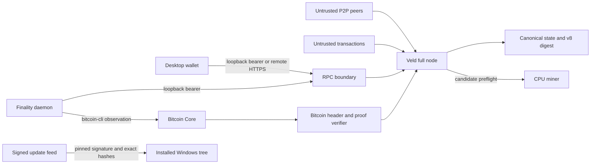

# Veld threat model

This document describes security boundaries and design assumptions for the Veld
public-mainnet-v2 source. It is not a vulnerability report, an audit
certificate, or a guarantee that the software is secure.

## Overview

Veld is a public, CPU-proof-of-work blockchain with a stateful transaction
engine, post-quantum transaction signatures, a bonded seven-validator finality
layer, and a Bitcoin-SPV-backed btcVELD reserve. A production deployment can
include a full node/miner, a desktop wallet, a loopback RPC service, a
standalone finality daemon, Tor or clearnet P2P transport, and a signed Windows
updater.

The public profile is `veld-public-mainnet-v2`. Its release version is separate
from protocol and chain identity; compile-time guards keep public mainnet,
public testnet, regtest, developer, and fleet-no-mine builds distinct
([include/core/version.h](../../include/core/version.h), [include/core/constants.h](../../include/core/constants.h)). The public
datadir records an exact identity containing the compiled profile, genesis,
magic, ports, and rolling-reserve semantics and refuses an incompatible or
unidentified nonempty datadir ([include/network/network_identity.h](../../include/network/network_identity.h)).

### Components

| Component | Responsibility | Important source |
| --- | --- | --- |
| Full node and miner | P2P, validation, LevelDB chainstate, RPC, candidate construction, replay and reorganization | [src/veld-node.cpp](../../src/veld-node.cpp), [include/node/node.h](../../include/node/node.h) |
| Consensus engine | Supply, staking, validators, finality, tokens, reserve, AMM, governance and deterministic state digest | [include/core/blockchain.h](../../include/core/blockchain.h), [include/consensus/staking.h](../../include/consensus/staking.h), [include/consensus/state_digest.h](../../include/consensus/state_digest.h) |
| Desktop wallet | Local web UI, key use, local bearer RPC, or authenticated remote HTTPS RPC | [src/veld-desktop.cpp](../../src/veld-desktop.cpp) |
| Finality daemon | Seed-bound ML-DSA votes, persist-before-submit journal, node RPC and independent Bitcoin observation | [src/veld-validator.cpp](../../src/veld-validator.cpp) |
| btcVELD reserve | Bitcoin headers, custody provenance commitments, one rolling reserve outpoint, mint/redemption accounting | [include/core/btc_header_chain.h](../../include/core/btc_header_chain.h), [include/consensus/btcveld_reserve_transition.h](../../include/consensus/btcveld_reserve_transition.h), [include/core/onchain_tokens.h](../../include/core/onchain_tokens.h) |
| P2P and NAT traversal | Peer handshake, message limits, Tor, reachability and correlation-bound hole punching | [include/network/p2p.h](../../include/network/p2p.h), [include/network/tcp.h](../../include/network/tcp.h) |
| Build and update path | Role-specific unsigned builds, source identity, deployment attestation, signed Windows update installation | [build/mainnet-v2-linux.sh](../../build/mainnet-v2-linux.sh), [build/mainnet-v2-windows.sh](../../build/mainnet-v2-windows.sh), [pkg/veld-update.ps1](../../pkg/veld-update.ps1) |

### Effective resources and deployment-sensitive boundaries

| Deployment or workflow | Resource or capability | Configuration and precedence | Safe effective value or location | Readers, writers, or recipients | Enforcing control | Evidence or unknowns |
| --- | --- | --- | --- | --- | --- | --- |
| Public node, miner, endorser or fleet | Chainstate and network identity | Compiled profile, then explicit/default datadir | Default `./veld-data`; exact `network.identity` for public-mainnet-v2 | Node, P2P and RPC identity consumers | Owner-only directory, byte-exact marker, no implicit migration | [include/network/network_identity.h](../../include/network/network_identity.h), [src/veld-node.cpp](../../src/veld-node.cpp) |
| Core node RPC | Node control and transaction submission | Encrypted token under datadir; requested port may move to a bounded fallback | Plain HTTP on `127.0.0.1`; token and actual port remain owner-only | Local wallet, validator and operator processes | Empty-token refusal, loopback bind, Host/origin checks, constant-time bearer comparison | [include/network/rpc_http.h](../../include/network/rpc_http.h), [src/veld-node.cpp](../../src/veld-node.cpp) |
| Remote desktop RPC | Remote node data and transaction relay | Exact operator URL or default HTTPS endpoint | HTTPS only; plaintext accepted only for `127.0.0.1`/`localhost` | Remote TLS service and local wallet UI | Strict authority parser, certificate and hostname validation, no redirects; local bearer is not sent remotely | [src/veld-desktop.cpp](../../src/veld-desktop.cpp); server-side proxy policy is external |
| Terminal Windows mining | P2P privacy/reachability | `Start Mining.bat`; only the separately named wrapper sets exact clearnet opt-out | Tor SOCKS on loopback and persistent onion service by default | Tor, node and Internet peers | Pinned Tor/helper hashes, owner-only tree, fail-closed bootstrap | `pkg/Start Mining.bat:255-258`, `pkg/Start Mining.bat:327-372`, `pkg/Start Mining (Clearnet).bat:1-14` |
| Windows GUI | P2P privacy/reachability | Saved GUI settings | Source default is reachable clearnet; Tor is an explicit GUI choice | Child node and Internet peers | Signed package check and persisted transport setting | [src/veld-node-gui.cpp](../../src/veld-node-gui.cpp); the terminal Tor default must not be generalized to this path |
| Linux finality daemon | Validator key, vote journal and node authority | Validator key path and datadir; sibling node exports the local bearer | `<validator-key>.finality-state/journal.bin`; node RPC on loopback | Daemon, local node and Bitcoin Core CLI | Private directory, seed-bound key, persist-before-submit voting | [src/veld-validator.cpp](../../src/veld-validator.cpp); service topology and key ceremony are external |
| btcVELD consensus | Reserve and Bitcoin fork state | Compiled custody commitments and checkpoint, then relayed headers/proofs | One represented Bitcoin outpoint and complete retained fork state | Token ledger, reserve state and all validating nodes | Canonical transaction parsing, Bitcoin PoW/retarget/MTP, most work, checkpoint, Merkle proof and finality depth | [include/core/constants.h](../../include/core/constants.h), [include/core/btc_header_chain.h](../../include/core/btc_header_chain.h), [include/consensus/btcveld_reserve_transition.h](../../include/consensus/btcveld_reserve_transition.h) |
| Release/update | Candidate and installed executable identity | Clean commit/tree, role definitions, then a separately signed manifest | External build directories and exact installed package tree | Release operator and Windows updater | Profile interlocks, deployment probes, pinned signature, exact file set, rollback/equivocation refusal | [build/mainnet-v2-linux.sh](../../build/mainnet-v2-linux.sh), [build/mainnet-v2-windows.sh](../../build/mainnet-v2-windows.sh), [pkg/veld-update.ps1](../../pkg/veld-update.ps1); signing ceremony is external |

## Trust boundaries and assumptions

### Protected assets and security objectives

- The canonical UTXO set, issuance counter, and 21,000,000 VELD cap. There is
  no separately issued premine or treasury allocation; protocol reward-vault,
  pool, endorsement, and cadence outputs are recipients within capped coinbase
  issuance, not a second mint ([include/core/constants.h](../../include/core/constants.h),
  [include/node/node.h](../../include/node/node.h), [include/core/blockchain.h](../../include/core/blockchain.h)).
- Staking must activate at exactly 10,000 issued VELD. A finality validator must
  have the separate exact 10,000 VELD qualifying bond, and finality requires at
  least seven qualified validators plus its warm-up
  ([include/core/constants.h](../../include/core/constants.h), [include/network/chainparams.h](../../include/network/chainparams.h),
  [include/consensus/finality_snapshot.h](../../include/consensus/finality_snapshot.h)).
- btcVELD must remain economically dormant until the chain-derived finality
  latch activates. A later liveness failure may pause new exposure without
  silently erasing existing completion/redemption obligations
  ([include/consensus/btcveld_peg_gate.h](../../include/consensus/btcveld_peg_gate.h),
  [include/consensus/btcveld_peg_gate.h](../../include/consensus/btcveld_peg_gate.h)).
- The represented Bitcoin reserve must equal circulating btcVELD plus open
  redemption principal plus surplus, and an accepted transition must consume
  the exact prior reserve once and prove a final canonical successor
  ([include/consensus/btcveld_reserve_transition.h](../../include/consensus/btcveld_reserve_transition.h),
  [include/consensus/btcveld_reserve_transition.h](../../include/consensus/btcveld_reserve_transition.h)).
- Replay, alternative-branch evaluation, startup recovery and reorganization
  must apply and roll back every stateful module in one deterministic order and
  commit the result under `VELD_STATE_DIGEST_v8`
  ([include/consensus/state_digest.h](../../include/consensus/state_digest.h),
  [include/node/node.h](../../include/node/node.h)).
- Mining templates must retain mandatory settlements and only a deterministic
  compatible subset of stateful mempool operations, then pass the same full
  module transition used by block validation
  ([include/mining/preflight_selector.h](../../include/mining/preflight_selector.h),
  [include/node/node.h](../../include/node/node.h)).
- Peer claims, endpoints and roles must remain untrusted; a peer cannot gain
  validator, fleet, RPC, or consensus authority by advertising a role
  ([include/network/p2p.h](../../include/network/p2p.h)).
- Wallet, validator, RPC and release keys must remain confidential and bound to
  their intended identity. Signed releases must reject missing, invalid,
  rollback, and equal-version-equivocating manifests
  ([include/crypto/release_verify.h](../../include/crypto/release_verify.h), [pkg/veld-update.ps1](../../pkg/veld-update.ps1)).

### Actors and starting capabilities

- A remote peer can create Sybils, send arbitrary bounded P2P payloads, lie
  about roles/heights/endpoints, and relay competing blocks or Bitcoin-header
  forks. It is not assumed to possess valid VeldHash work, validator private
  keys, a five-of-seven QC, or the release-signing key.
- A transaction submitter can create individually admissible but jointly
  conflicting stateful operations and manipulate fee ordering. It cannot
  bypass the complete consensus transition merely by entering the mempool.
- A Bitcoin eclipse/delay adversary can withhold headers or present a competing
  branch. It is not assumed able to forge accumulated Bitcoin work or rewrite
  the compiled/validator-observed checkpoint.
- A malicious or unavailable custody participant can delay payout. Threshold
  key ownership, signer separation, backups, fees, and recovery are external
  deployment facts; compiled descriptor/script commitments do not prove them.
- A remote HTTPS node can return dishonest application data or deny service.
  The desktop must still authenticate TLS and must never send its local bearer
  to that remote authority.
- A same-user local attacker or host administrator is outside several file-ACL
  boundaries: it may inspect process memory, replace operator tools, or roll
  back a volume. Owner-only files and encryption do not defend against a fully
  compromised operator account.
- A compromised update host can serve arbitrary bytes or disappear, but is not
  assumed able to forge the pinned release signature. Release-key compromise is
  a distinct, stronger threat.

### Important trust crossings

1. Untrusted peer bytes cross P2P parsing and compatibility checks before
   consensus validation ([include/network/tcp.h](../../include/network/tcp.h)).
2. Bitcoin headers and reserve proofs cross external-value gates before they
   can change btcVELD state ([include/core/btc_header_chain.h](../../include/core/btc_header_chain.h),
   [include/consensus/btcveld_reserve_transition.h](../../include/consensus/btcveld_reserve_transition.h)).
3. A validator daemon crosses into node authority only through loopback bearer
   RPC; its vote journal must be durable before a vote is submitted
   ([src/veld-validator.cpp](../../src/veld-validator.cpp)).
4. Local browser/desktop requests cross Host, origin, bearer, method, and size
   controls before reaching RPC ([include/network/rpc_http.h](../../include/network/rpc_http.h)).
5. Mempool state crosses a constructive preflight before becoming a candidate
   block ([include/mining/preflight_selector.h](../../include/mining/preflight_selector.h)).
6. Durable bytes cross canonical deserialize, hash and full replay checks
   before becoming live state ([include/node/node.h](../../include/node/node.h)).
7. Release inputs cross clean-tree/profile/deployment attestation, while
   installed Windows inputs additionally cross pinned signature and exact-hash
   verification ([build/mainnet-v2-windows.sh](../../build/mainnet-v2-windows.sh),
   [pkg/veld-update.ps1](../../pkg/veld-update.ps1)).

### Assumptions and known limits

- The 10,000-issued-VELD activation is an owner-authorized consensus change,
  not a security finding.
- Custody descriptor/manifest commitments and the effective P2TR script are in
  source, but signer ownership, independence, launch-record signatures,
  backups, and recovery are launch prerequisites outside this repository
  ([include/core/constants.h](../../include/core/constants.h)).
- Redemption default restores btcVELD and closes the liability after the
  configured deadline; it does not synthesize or guarantee delivery of Bitcoin
  ([include/core/onchain_tokens.h](../../include/core/onchain_tokens.h),
  [include/node/node.h](../../include/node/node.h)).
- The core node does not terminate remote TLS. Any public HTTPS RPC reverse
  proxy, server authentication, exposure policy, and availability controls are
  external to this source ([include/network/rpc_http.h](../../include/network/rpc_http.h),
  [src/veld-desktop.cpp](../../src/veld-desktop.cpp)).
- The terminal mining launcher is Tor-default, but the GUI source default is
  reachable clearnet. Public claims must identify which launcher they describe.
- Build controllers attest unsigned candidates. They do not prove the later
  signing ceremony, publication authorization, post-publication readback, or
  operational deployment.
- Public-mainnet consensus and the desktop wallet both let the first authorized
  valid liquidity seed set the immutable AMM opening anchor. The RPC returns an
  explicit policy identity, and the wallet checks that identity plus the exact
  returned legs, anchors, liveness witness and unsigned transaction before
  signing. Legacy profiles retain the fixed-ratio rule
  ([include/core/constants.h](../../include/core/constants.h), [include/core/amm_pool.h](../../include/core/amm_pool.h),
  [include/network/rpc.h](../../include/network/rpc.h), [include/network/ui_desktop.h](../../include/network/ui_desktop.h),
  [include/network/ui_desktop.h](../../include/network/ui_desktop.h)).
- VeldHash, ML-DSA/ML-KEM, the operating-system CSPRNG, TLS trust stores,
  Bitcoin Core, LevelDB, host ACLs, and operator backups are trusted
  prerequisites unless separately assessed.

## Attack surface and mitigations

The following are review hypotheses, not confirmed vulnerabilities.

| Priority | Scenario and capability gain | Prerequisites | Impact | Existing controls | Mitigation or validation target | Evidence |
| --- | --- | --- | --- | --- | --- | --- |
| Critical | Forge or bypass supply/reward accounting to mint above 21M | Consensus-validation flaw | Inflation and chain split | Supply-aware coinbase and cap checks | Boundary, replay and alternative-branch tests at every issuance path | [include/core/blockchain.h](../../include/core/blockchain.h) |
| Critical | Accept a reserve transition that does not consume the exact canonical Bitcoin reserve or balance liabilities | Parser, fork-selection or state-binding flaw | Unbacked btcVELD or redirected reserve | Exact outpoint/value, RVS1 classifier, Merkle/best-chain/finality and accounting checks | Fuzz/parser tests plus OPEN/DEPOSIT/ROLLOVER/PAYOUT/CLOSE/FREEZE and reorg rollback cases | [include/consensus/btcveld_reserve_transition.h](../../include/consensus/btcveld_reserve_transition.h) |
| Critical | Forge finality or reorganize around a finalized target/carrier | Validator-key compromise or QC/reorg bug | Invalid finality, peg activation or history rewrite | Equal bonds, sorted snapshot, network/genesis-bound votes, strict five-of-seven QC, target/carrier preservation | Independent QC codec/weight/equivocation and reorg-boundary validation | [include/consensus/finality_qc.h](../../include/consensus/finality_qc.h) |
| High | Exploit Bitcoin fork/checkpoint handling to admit proof from a noncanonical branch | Header relay/eclipsing plus validation defect | False mint, payout or reserve successor | Header linkage, PoW, retarget, MTP, most work, compiled and observed checkpoints | Competing-fork, retarget, checkpoint, depth and terminal-reorg tests | [include/core/btc_header_chain.h](../../include/core/btc_header_chain.h) |
| High | Make startup replay or reorganization omit/partially publish a stateful module | Crafted chain plus replay/rollback defect | Persistent state divergence | Canonical deserialize/hash, full AddBlock replay, complete snapshots and staged publication | Fresh-process digest equality, injected publication failure and full rollback comparison | [include/node/node.h](../../include/node/node.h) |
| High | Use conflicting stateful mempool operations to starve or invalidate mining templates | Transaction submission and fee ordering | Mining liveness loss or invalid templates | Constructive selector, mandatory suffix and exact full-module preflight | Adversarial conflicts, dependency lifecycle, parity and bounded-work tests | [include/mining/preflight_selector.h](../../include/mining/preflight_selector.h), [include/node/node.h](../../include/node/node.h) |
| High | Abuse a remote RPC endpoint to steal the local bearer or trick the wallet into plaintext/redirected transport | Malicious endpoint/DNS/network | Wallet privacy loss or unauthorized local-node control | Remote plaintext rejection, strict authority parser, TLS validation, no redirects, local-bearer separation | Cross-platform TLS, hostname, self-signed, response-limit and total-deadline tests | [src/veld-desktop.cpp](../../src/veld-desktop.cpp) |
| High | Install an unsigned, downgraded, equivocated or incomplete Windows package | Update-host control or local staging manipulation | Arbitrary code execution under operator account | Pinned signature, strict version, authenticated archive checksum, exact file set, atomic recovery | Negative signature/hash/path/version tests and interrupted-update recovery | [pkg/veld-update.ps1](../../pkg/veld-update.ps1) |
| Medium | Turn hole-punch coordination into private-network scanning, reflection or connection exhaustion | Coordinating peer and victim reachability | Availability or unintended outbound connectivity | Public-routable IPv4 parser, handshake/capability binding, CSPRNG correlations, expiries and caps | Correlation replay, private-address, per-IP and total-dial regression tests | [include/network/tcp.h](../../include/network/tcp.h) |
| Medium | Spoof forwarded identity to evade RPC/portal rate limits | Misconfigured reverse proxy or untrusted forwarding headers | Resource exhaustion or policy bypass | Loopback RPC boundary, explicit parsing and bounded workers/requests | Treat proxy trust as deployment configuration and test sibling-header ambiguity | [include/network/rpc_http.h](../../include/network/rpc_http.h) |
| Medium | Leak or reuse a validator vote after crash/rollback | Local storage rollback or journal-order defect | Equivocation and slash exposure | Private journal, seed-bound identity and persist-before-submit order | Crash injection, journal rollback and competing-vote tests | [src/veld-validator.cpp](../../src/veld-validator.cpp) |
| Medium | Accidentally ship a test/regtest/diagnostic or mining-capable fleet artifact as production | Build/release process error | Wrong consensus profile, secret test surface or unexpected mining | Compile-time interlocks, role-specific controllers and deployment probes | Expected compile failures and negative fleet help/RPC probes on every platform | [include/core/version.h](../../include/core/version.h), [include/core/constants.h](../../include/core/constants.h), [build/mainnet-v2-linux.sh](../../build/mainnet-v2-linux.sh) |
| Operational | Desktop and RPC opening-anchor policy drift | A future profile or client change updates only one side | Opening-liquidity liveness failure or signing under unintended policy | Explicit RPC policy identity, profile-derived UI mode, exact returned-leg/anchor and unsigned-transaction checks | Run public nonfixed and legacy fixed-ratio parity regressions on every release | [include/core/amm_pool.h](../../include/core/amm_pool.h), [include/network/rpc.h](../../include/network/rpc.h), [include/network/ui_desktop.h](../../include/network/ui_desktop.h) |
| Operational | Custody signers withhold payout or fail recovery | External signer availability or common-control failure | Redemption delay; default restores btcVELD rather than delivering BTC | On-chain liability, exact payout proof and deterministic default | Publish verifiable signer topology, service objectives, fee policy, backup and recovery evidence before activation | [include/core/onchain_tokens.h](../../include/core/onchain_tokens.h), [include/node/node.h](../../include/node/node.h) |

## Impact classification

- **Critical:** a realistic unauthenticated or ordinary-transaction path to
  inflation, acceptance of unbacked reserve state, forged finality, arbitrary
  release installation without the signing key, or deterministic consensus
  divergence. A hypothesis is not Critical merely because it touches consensus;
  the attacker-to-impact path must be established.
- **High:** a reachable defect that can cause major loss, persistent chain or
  reserve corruption, remote wallet compromise, or broad release compromise,
  but requires a meaningful prerequisite such as an eclipse, crafted accepted
  chain, or exposed remote service.
- **Medium:** bounded denial of service, privacy or rate-limit failure,
  constrained validator slash exposure, or a serious deployment-dependent
  weakness without evidence that the necessary public exposure exists.
- **Low:** limited-impact robustness or information exposure with strong local,
  same-user, optional-feature, or difficult timing prerequisites.

Operator-authorized behavior, self-only effects, documentation discrepancies,
and risks requiring an already compromised host or release private key are not
automatically vulnerabilities. Missing runtime evidence lowers confidence; it
does not erase a source-backed attack path. Conversely, architecture and test
coverage alone do not prove that a security control is correct.
